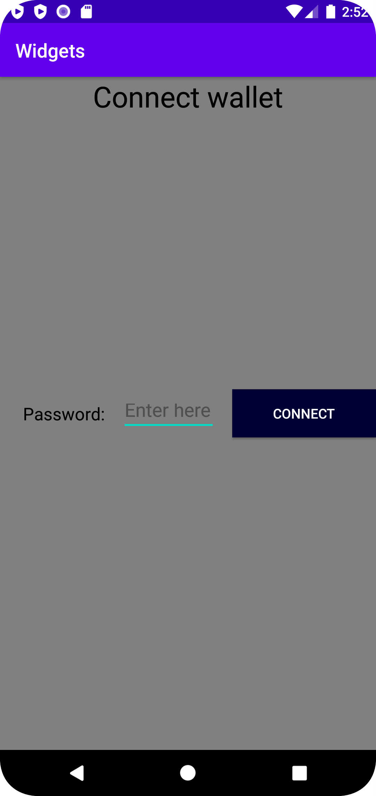

# Rapport


Jag har valt att göra en Wallet connection App där användaren behöver mata in ett lösenord för att koppla sin wallet
till någon Webbplats. Jag har valt att använda mig av en constraint layout för mina views.
Den första viewn som skapades var en textView som visas på toppen av skärmen som säger "Connect Wallet". Tillhörande xml kod finns nedan.

```
<TextView
        android:id="@+id/textView"
        android:layout_width="wrap_content"
        android:layout_height="wrap_content"
        android:text="Connect wallet"
        android:textColor="#000000"
        android:textSize="30dp"
        app:layout_constraintLeft_toLeftOf="parent"
        app:layout_constraintRight_toRightOf="parent"
        app:layout_constraintTop_toTopOf="parent" />
```

Sedan skapades en EditText view där användaren kan mata in sitt lösenord med en hint som säger "Enter here"

```
<EditText
        android:id="@+id/editText"
        android:layout_width="100dp"
        android:layout_height="40dp"
        android:hint="Enter here"
        android:textSize="20sp"
        app:layout_constraintBottom_toBottomOf="@+id/textView2"
        app:layout_constraintEnd_toStartOf="@+id/button"
        app:layout_constraintStart_toEndOf="@+id/textView2"
        app:layout_constraintTop_toTopOf="@+id/textView2" />

```

Den tredje viewn som skapades är en button som säger "Connect" efter att användaren har matat in sitt löserord.

```
<Button
        android:id="@+id/button"
        android:layout_width="150dp"
        android:layout_height="50dp"
        android:background="@color/NavyBlue"
        android:textColor="@color/White"
        android:text="@string/connect"
        app:layout_constraintBottom_toBottomOf="parent"
        app:layout_constraintEnd_toEndOf="parent"
        app:layout_constraintTop_toTopOf="parent" />

```
Behövde tillägga en till textView som säger "Password:" innan EditText så att användaren vet att det är ett lösenord som ska matas in fältet.

```
<TextView
        android:id="@+id/textView2"
        android:layout_width="wrap_content"
        android:layout_height="wrap_content"
        android:text="Password:"
        android:textColor="@color/black"
        app:layout_constraintStart_toStartOf="parent"
        android:layout_marginStart="24dp"
        android:layout_marginLeft="24dp"
        android:textSize="18sp"
        app:layout_constraintBottom_toBottomOf="parent"
        app:layout_constraintTop_toTopOf="parent" />
```




